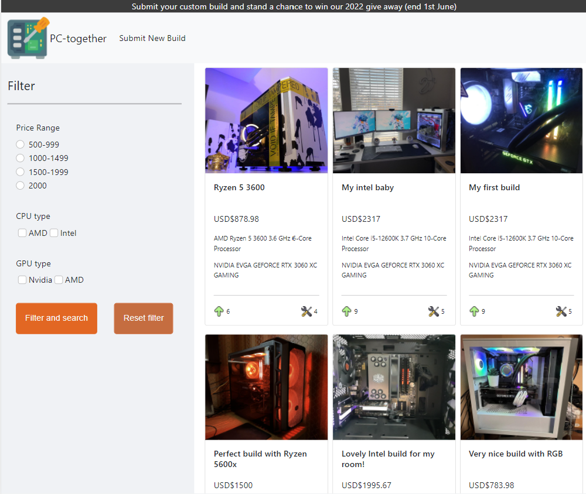
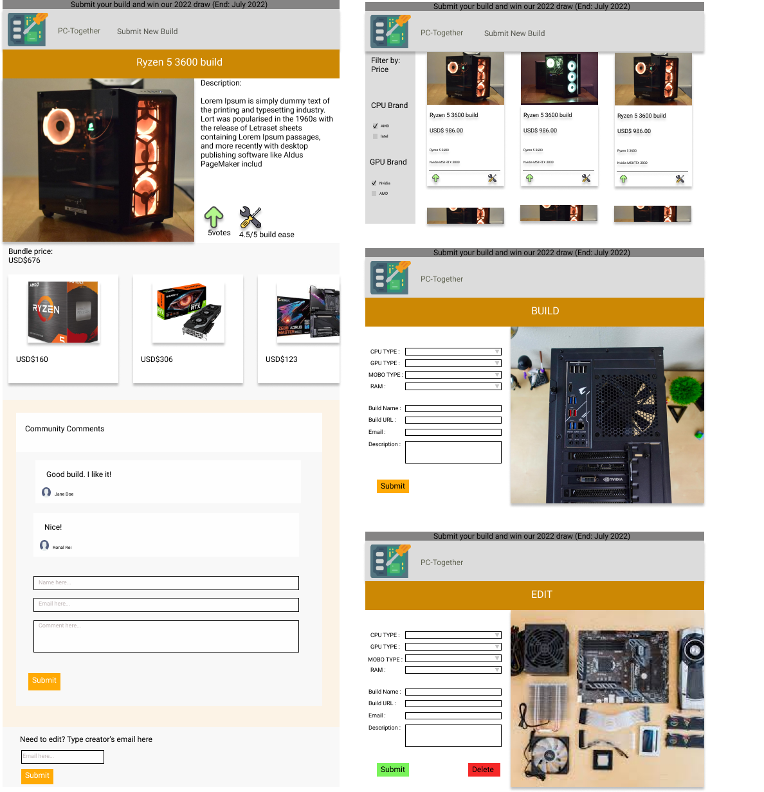
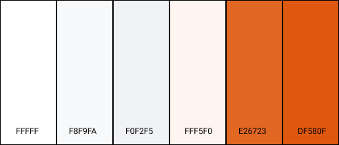

# PC-Together 
 

Access the live demo of the website [here](https://ephemeral-sunshine-555075.netlify.app/index.html).

## Project Summary

**Project Context**

 _PC-Together_ is a mobile-responsive application developed for PC (personal computer) enthusiast and aspiring PC enthusiast to be able to share their builds, ideas and comments.

**User Goals**

The aim of users is to get recommendations and inspiration of PC builds while understanding the cost and details that consist of the build. With the infomation for every build, users are able to better gauge their preference while still considering the price of parts that is required for the build. 

**Organisational Goals**

The app aims to provide users with recommendations from paid avenues that promotes their hardware parts. Additionally, revenue through advertisements can be generated.

**Justification for the App**

PC-Together aims to provide a community driven space where honesty of builds are paramount. This helps builders to identify any critical flaws with certaint hardware parts within the PC building industry.

## UX/UI

### **Strategy**
_User_
* Objective: To showcase individual build and promote positive builds to the PC building community

* Needs: Provide filters by price, brand and upvotes. Reviews from the public is import to encourage a healthy discussion on builds

* Demographics:
    * Users can come from all walks of life but is targeted towards the younger populations where they are interested in technology
    * Some users are presumed to be new towards the PC building hobby
    * Sufficient literacy in using technological devices

User Stories | Acceptance Criteria(s)
------------ | -------------
As a pc enthusiast, i would like to view latest pc builds so as to keep in touch with the PC building community by looking at the latest technologies. | Card listings from community that can be looked at in detail while having a comment page.
As a new PC builder, i would like to see the recommened builds by price so that i can make a informed decision on what i want for my PC build. | Filter function for price.
As a pc enthusiast, i would like to know the updated prices of PC builds so that i can purchase the parts of the PC at a fair market value. | Show the market price in details for each listing.

### **Scope**

_Functional Specifications_
* Have a page which shows all the PC build as listings

* Have a filter function based on price, CPU brand, GPU brand for all PC build listings

* Able to see details of a particular build, see the part prices

* To be able to interact with the community on the various builds

* To be able to add in new builds to the system

* To be able to edit and delete builds (owner of particular build)

_Non-functional requirements_
* Mobile responsiveness
    * Achieved via the use of appropriate media queries and flex box

### **Skeleton**

 

Access the Figma skeleton framework [here](https://www.figma.com/file/PVDzZc4kCaQB5cI72H7KrO/PC-Together).

### **Surface**

_Colours_

 

* The main color scheme of the app follows a orange hue with a basic white base. 
To make the website vibrant, the color orange has been chosen for its main theme. A white base helps users to be able to read and see the contents of the builds better. This makes the listing of the build stand out because the submitted images of the pc builds are inherently colorful.

_Font Choice_
* The main font used for the contents is sans-serif. This font is used because it is a common font where most users are comfortable reading.

## Features
1. **Main page**. Users can scroll through all the listings that the database projects. In each card for the listing, it will show the name of the build, price of the build, CPU and GPU used.

2. **Filter for price, CPU and GPU brand** This feature is used to narrow down the search results for the user. User can search in a various combination of price together with the brand of CPU and GPU.

3. **Users can click on listing cards to see listing details** This feature helps declutter the main page from all the details in each listing. Therefore, if the user is interested in any builds, they can look further into the card.

4. **Creator of the listing can delete or edit the computer build** Creators can access their listing by entering a valid email that was asked for before creating the build. This helps ensure that no one else besides the creator is able to delete or edit the build. 

## Testing

**Test Cases**

Access the test cases [here](https://github.com/MarcusCWD/PC-together-front/blob/main/test-case/Test%20Case.pdf).

**Testing for Mobile Responsiveness**
 * Testing was done using chrome developer tool with variable width sizes from 330px to 1400px

## Technologies Used

* HTML5
    * To create the framework of the web app
* CSS3
    * To style various elements throughout the web app
* JavaScript
    * To include interactive elements throughout the web app
* [Bootstrap v5.0](https://getbootstrap.com/docs/5.0/getting-started/introduction/)
    * To create dropdown
    * To create checkbox
    * To create radio buttons
    * To create Navbar
    * To create Cards
* [Font Awesome](https://fontawesome.com/)
    * For icons for filter
* [Flaticon](https://www.flaticon.com/)
    * For used for main icon, vote and build ease
* [Figma](https://www.figma.com/)
    * To create the skeleton mock up
* [Git](https://git-scm.com/)
    * For version control
* [GitHub](http://github.com)
    * To create repository
* [Netlify](https://www.netlify.com/)
    * To deploy web app
* [Heroku](https://dashboard.heroku.com/)
    * To deploy backend API

## Deployment

The web app is hosted using Netlify.
The back end API is hosted using Heroku.

**Dependencies**

* [Axios](https://cdnjs.com/libraries/axios)
    * To call API
* [Express JS](https://expressjs.com/)
    * Used for backend
* [MongoDB](https://www.mongodb.com/)
    * Used for backend data CRUD operation

## Credits

* Icons on the app
    * Downloaded and edited from [Flaticon](https://www.flaticon.com/)

## Backend API service link

* [MongoDB](https://github.com/MarcusCWD/PC-together)